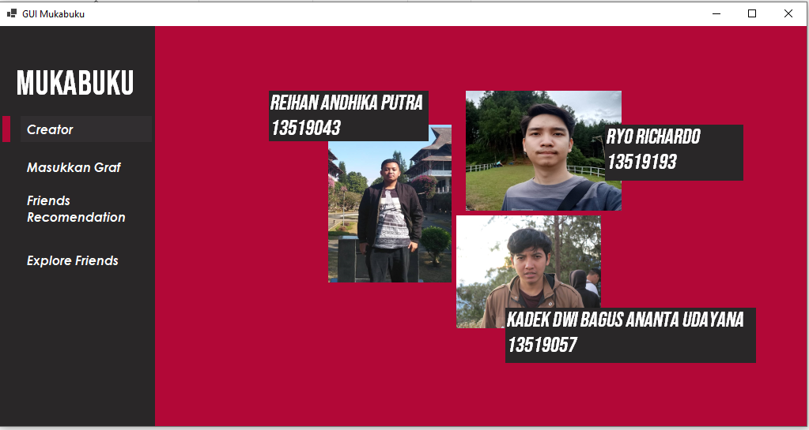
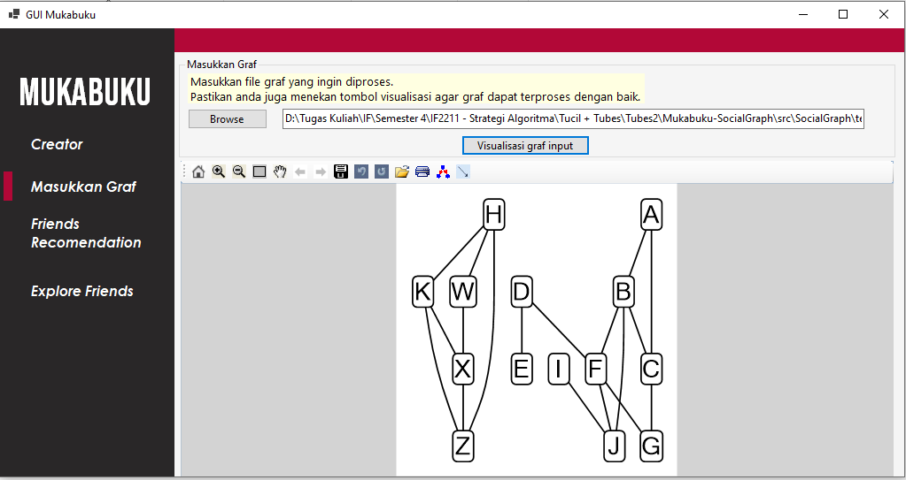
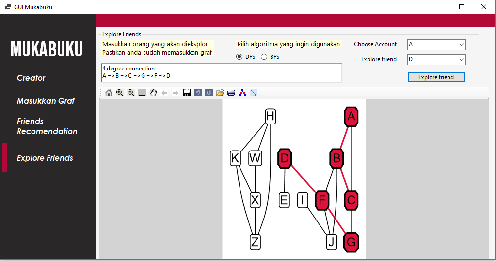
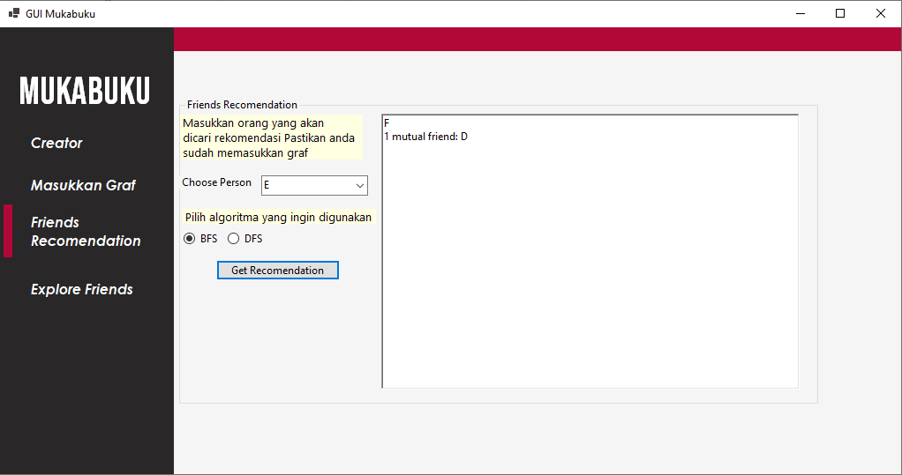

# Mukabuku Socialgraph
Tugas Besar IF2211 Strategi Algoritma 
Program Studi Teknik Informatika 
Institut Teknologi Bandung 
2021

## Description
Mukabuku Socialgraph adalah aplikasi yang dapat menampilkan visualisasi graf pertemanan dari input file dengan ekstensi .txt. Selain itu, Mukabuku Socialgraph juga mempunyai fitur Friend Recommendation yang mencari daftar rekomendasi teman baru dengan algoritma BFS dan DFS dari salah satu orang yang dipiih. Mukabuku Socialgraph juga dilengkapi dengan fitur Explore Friend yang dapat mencari derajat keterhubungan antara dua orang yang dipilih dengan menggunakan algoritma BFS dan DFS. 

## Algoritma BFS dan DFS
BFS merupakan singkatan dari Breadth First Search. Secara umum, BFS merupakan algoritma penelusuran simpul dari graf atau pohon secara "melebar". Algoritma BFS akan mengunjungi semua simpul yang terhubung dengan simpul akar secara bergantian, dan mengulangi untuk setiap simpul anaknya hingga menemukan simpul yang memenuhi kondisi.

Sementara itu, DFS merupakan singkatan dari Depth First Search. Berlawanan dengan BFS, DFS merupakan algoritma penelusuran simpul dari graf atau pohon secara "mendalam". Algoritma DFS akan mengunjungi salah satu simpul yang terhubung dengan simpul akar secara terus menerus hingga menemukan simpul yang memenuhi kondisi. Apabila belum menemukan simpul namun sudah mencapai simpul daun, maka algoritma DFS akan melakukan backtracking dan mengunjungi cabang simpul lain dari simpul sebelumnya.

## Requirements
Tidak ada aplikasi khusus yang perlu diinstalasi untuk menjalankan aplikasi ini jika anda ingin run program lewat file executable. Namun, jika anda ingin melihat struktur project Mukabuku Socialgraph dan run lewwat file solution(.sln), dianjurkan untuk melakukan instalasi aplikasi [Microsoft Visual Studio](https://visualstudio.microsoft.com/vs/) yang dilengkapi kakas .NET Toolbox. dan install .NET Desktop development didalamnya > :exclamation: Karena aplikasi memanfaatkan MSAGL sebagai alat visualisasi graf, maka aplikasi hanya dapat berjalan di sistem operasi Windows.

## How to use (Via .exe)
Untuk menjalankan Mukabuku Socialgraph, ikuti langkah-langkah berikut:
* Download/Clone repository ini
* Klik aplikasi Mukabuku Socialgraph (SocialGraph.exe) yang terletak di folder bin
* Pilih menu `Masukkan Graf`, kemudian klik `Browse` untuk input file txt
* Pilih file txt yang merepresentasikan graf pertemanan. Contoh format file yang benar ada di folder `src/testcase`
* Klik `Visualisasikan graf input` untuk menampilkan graf
* Pilih menu `Friends Recommendation` untuk mencari rekomendasi teman baru. Pilih nama orang yang ingin dicari rekomendasinya serta algoritma yang ingin digunakan, kemudian klik `Get Recommendation`
* Pilih menu `Explore Friends` untuk mencari derajat keterhubungan antara dua orang. Pilih nama orang pertama, orang kedua, dan algoritma yang ingin digunakan, kemudian klik `Explore friend`

## How to use (Via .sln)
Untuk menjalankan Mukabuku Socialgraph, ikuti langkah-langkah berikut:
* Download/Clone repository ini
* Bukalah IDE Visual Studio yang sudah anda install
* Pilih menu `open project`dan targetkan file solution yang ada di dalam folder src (SocialGraph.sln)
* Tunggu hingga project di load ke dalam Visual Studio kalian
* Tekan tombol f5 ataun tekan tombol play yang ada di tengah atas Visual Studio untuk menjalankan aplikasi
* Pilih menu `Masukkan Graf`, kemudian klik `Browse` untuk input file txt
* Pilih file txt yang merepresentasikan graf pertemanan. Contoh format file yang benar ada di folder `src/testcase`
* Klik `Visualisasikan graf input` untuk menampilkan graf
* Pilih menu `Friends Recommendation` untuk mencari rekomendasi teman baru. Pilih nama orang yang ingin dicari rekomendasinya serta algoritma yang ingin digunakan, kemudian klik `Get Recommendation`
* Pilih menu `Explore Friends` untuk mencari derajat keterhubungan antara dua orang. Pilih nama orang pertama, orang kedua, dan algoritma yang ingin digunakan, kemudian klik `Explore friend`

## Author
Program ini dibuat oleh:
* Reihan Andhika P - 13519043
* Kadek Dwi Bagus A U - 13519057
* Ryo Richardo - 13519193

## Screen Capture Creator Page

## Screen Capture Input Graf

## Screen Capture Friend Exploration

## Screen Capture Friend Recomendation

